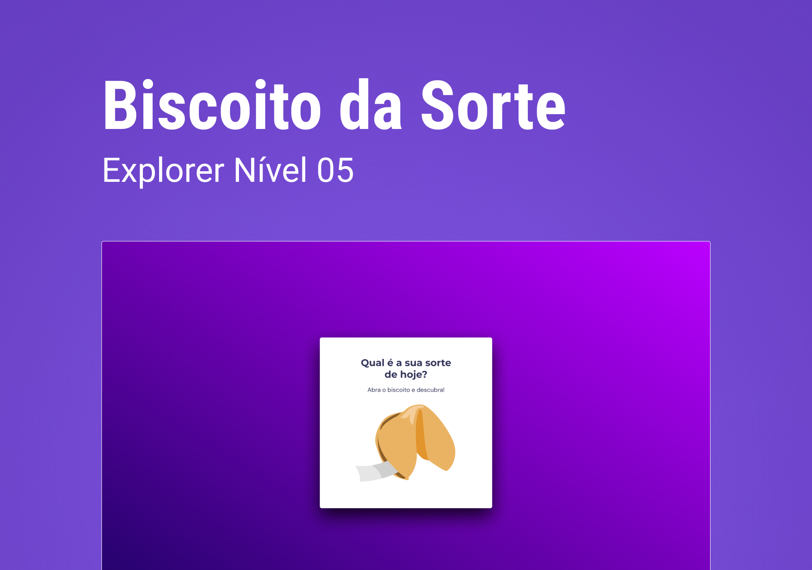

## Fortune Cookie

Challenge to review some **JavaScript** concepts

- HTML Data structure
- CSS Animations
- Functions
- DOM manipulation
- JS Library Math()
- *callback* functions
- Arrays

## License
This project is licensed under the MIT License - see the LICENSE.md file for details
